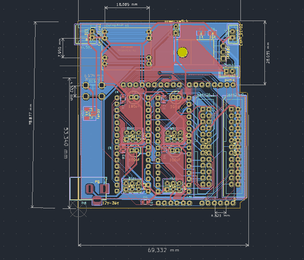
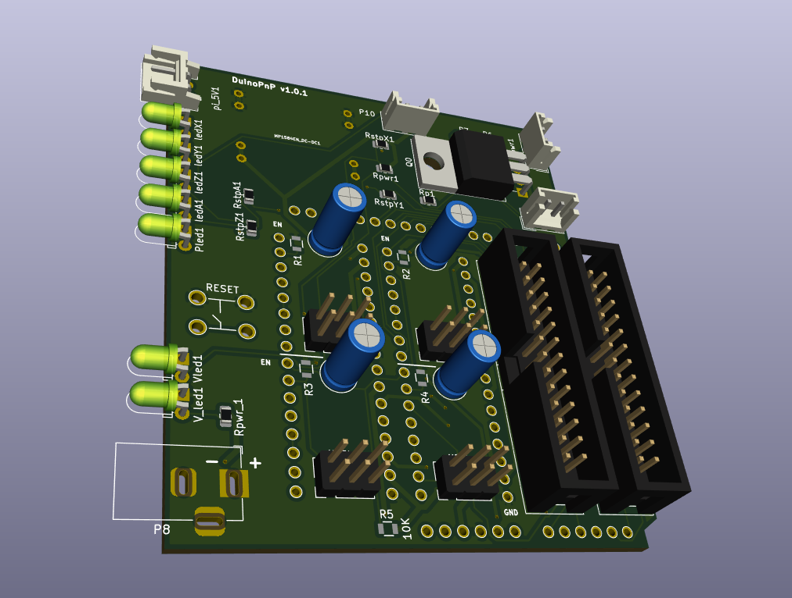

# DuinoPnP v1
Here are the kicad files for the prototype shield for the machine, it is designed with the arduino-uno form factor, i call it the "duinoPnP"

## v1.0.1 3D viewer

Global 3D view of V1.0.1 PCB

