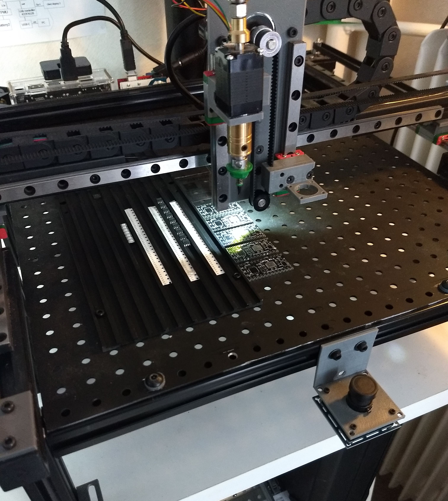
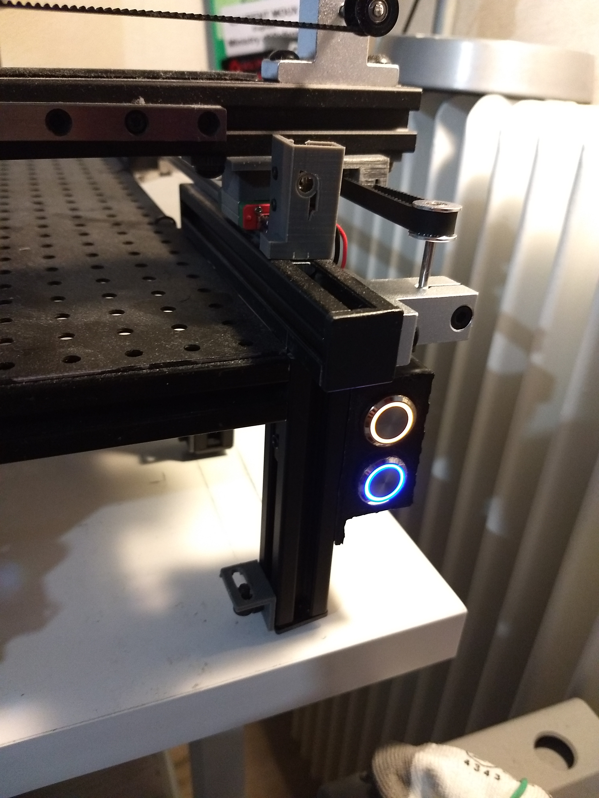
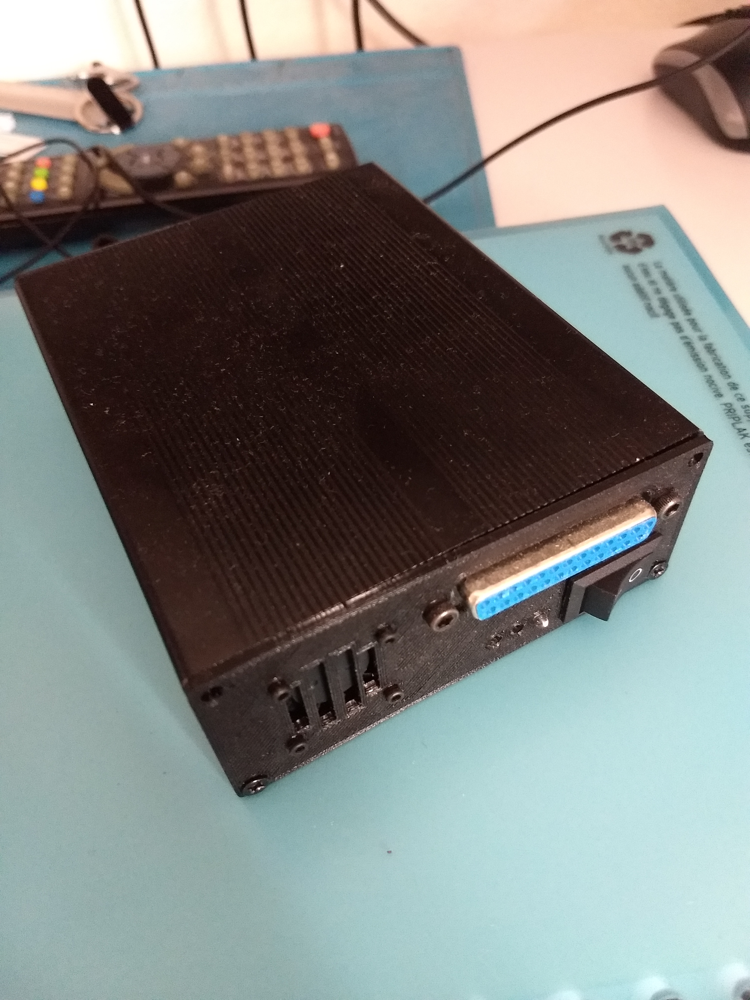

 <h1>MagnetCnC_3</h1>

 

This is a prototype for pick and place, smd soldering but also laser cutting/engraving.
The head and the moving arm of the prototype will be design to be modular and magnetic (No screwing is neeeded to change/upgrade the head or arm).

## Visual overview
This is a visual overview of what the prototype does... for the moment, because it will does more "usecool" things like soldering and laser engraving or cutting.

## Global view of the prototype

## Buttons
This is a view of two buttons for reset and unlock operations but it can be re-configured for others actions.

## Pnpbox1 
This is an overview of the prototype box which contains all the mains components, the pump too ! .

